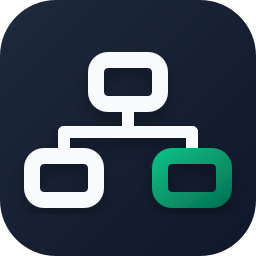
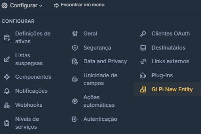
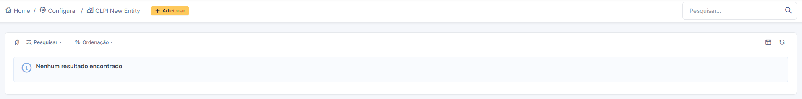
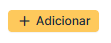
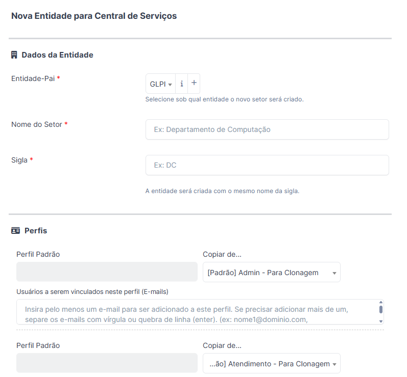
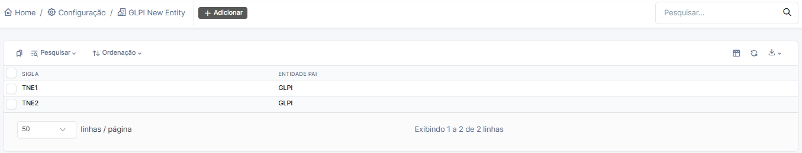
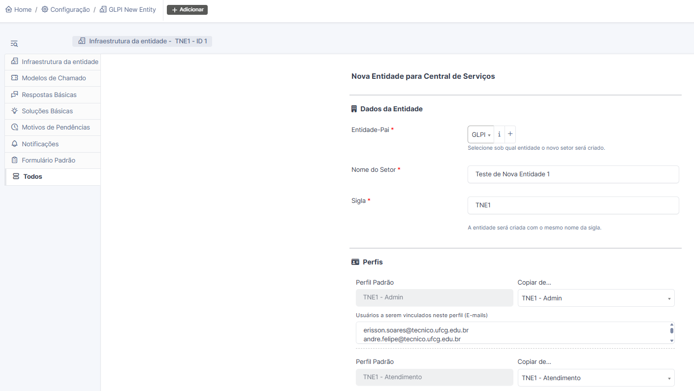

<div align="right">
  🇧🇷 <a href="./README.md">Português</a> | 🇬🇧 <a href="./docs/readme/README.en.md">English</a> 
</div>

# GLPI New Entity Plugin - Criação de toda a estrutura de uma nova entidade em uma única tela
[](https://glpi-project.org/)
[](https://glpi-project.org/)
[](https://www.gnu.org/licenses/gpl-3.0.html)

<p align="center">
  <br><br>
</p>

O **GLPI New Entity Plugin** é um plugin de "onboarding" rápido e otimizado desenvolvido para o GLPI 11/12. Ele tem o propósito de automatizar a configuração estrutural completa de um novo Setor / Departamento em um único formulário unificado ("Wizard"). 

Ao invés de navegar por diversas telas diferentes do GLPI para criar entidades, configurar perfis, vincular usuários, criar grupos, associar técnicos e montar catálogos de serviços (categorias), este plugin resolve todo o processo em uma única tela, garantindo extrema agilidade, organização padronizada e minimizando erros humanos.

## ✨ Funcionalidades Principais

*   **Criação Rápida de Entidade:** Cria imediatamente uma nova entidade sob uma entidade-pai escolhida.
*   **Clonagem de Perfis Nativos:** Permite selecionar perfis preexistentes (como Super-Admin, Admin, Atendimento) e cloná-los, nomeando-os automaticamente com o prefixo da sigla do novo setor (Ex: `[DC] - Admin`).
*   **Vinculação Direta por E-mail:** Basta colar uma lista de e-mails, separados por vírgula ou quebra de linha. O plugin busca o usuário no banco de dados e automaticamente vincula o perfil à nova entidade em escopo recursivo.
*   **Gerenciamento Inteligente de Grupos e Subgrupos:**
    *   Cria automaticamente um "Grupo Pai" nomeado com a sigla do setor `(SIGLA)`.
    *   Permite a criação de múltiplos Subgrupos aninhados de forma dinâmica.
    *   Associa os técnicos atendentes aos respectivos subgrupos (ou diretamente ao Grupo Pai) a partir de uma lista de e-mails.
*   **Construção Automática de Árvore de Categorias ITIL:**
    *   Aceita listas hierárquicas em formato de texto usando hífens (ex: `- Hardware`, `-- Manutenção`, `--- Reparos`).
    *   Cria categorias de incidentes e requisições perfeitamente aninhadas com apenas um clique.
*   **Aba de Configurações Dinâmicas:** Centraliza a personalização do fluxo de trabalho e templates para o novo setor, permitindo criar, editar e aplicar múltiplas padronizações exclusivas para a entidade:
    *   **Modelos de Chamado**
    *   **Respostas Básicas**
    *   **Soluções Básicas**
    *   **Motivos de Pendências**
    *   **Notificações**
    *   **Formulários Padrões**
*   **Controle de Acesso e Segurança Nativos:** Desenvolvido seguindo os padrões mais rígidos de desenvolvimento seguro do GLPI. A interface e todos os fluxos de criação (endpoints) são protegidos pela matriz dinâmica de direitos do sistema (ACL). A instalação concede acesso de forma inteligente a todos os perfis com nível de Super-Admin de forma nativa e agnóstica, não dependendo de IDs engessados e não gerando poluição visual para os demais usuários.
*   **Edição e Atualização Sincronizada:** Em caso de ajustes futuros, o sistema armazena os metadados e permite reeditar os grupos, vínculos de e-mails ou nomes do setor a partir de um registro central.

## 🛠️ Requisitos

*   **GLPI:** Versão 11.0.0 ou superior.
*   **PHP:** Versões suportadas pelo GLPI 11 ou superior (8.1, 8.2, 8.3, 8.4).

## 🚀 Instalação

1. Baixe os arquivos do repositório ou clone este projeto no diretório de plugins do seu servidor GLPI:
   ```bash
   cd /var/www/html/glpi/plugins/
   git clone https://github.com/andrefelipeufcg/glpinewentity.git
   ```
2. Certifique-se de que a pasta se chama estritamente `glpinewentity`. Corrija a nomenclatura se o git baixar com um sufixo diferente.
3. Acesse a interface web do GLPI com seu usuário **Super-Admin**.
4. Navegue até **Configurar > Plug-ins**.
5. Na lista, localize o `GLPI New Entity`, clique no botão de **Instalar** (ícone de pasta) e depois no botão **Ativar** (ícone de ligar).

## 🖥️ Como Usar

1. Entre no GLPI utilizando um usuário com perfil **Super-Admin**.
2. No menu principal superior, navegue até **Configurar > GLPI New Entity**.

3. Você visualizará uma lista (vazia caso seja a primeira vez) das infraestruturas de setores gerenciadas pelo plugin.

4. Clique em **Adicionar** (ou botão "+" dependendo do seu tema).

5. Siga as instruções do Wizard:

   *   **Entidade-Pai e Sigla:** Indique a localização na árvore corporativa e a sigla (que dará nome à entidade e aos grupos).
   *   **Perfis:** Determine de onde clonar o perfil e quais os e-mails dos encarregados daquele setor para herdarem esse acesso de forma recursiva.
   *   **Subgrupos e Técnicos:** Adicione quantos subgrupos precisar, e cole todos os e-mails dos técnicos responsáveis.
   *   **Catálogo (Categorias):** Cole ou escreva sua árvore de categorias usando "-" para subníveis.
6. Clique em **Salvar**.

O sistema irá iterar e provisionar o ambiente inteiro, exibindo alertas descritivos (inclusive ignorando e-mails inexistentes) e lhe devolvendo uma base pronta para operar em questão de segundos!



7. **Ajustes e Configurações Avançadas:** Após salvar, retorne à lista e clique no nome do setor que acabou de criar para editá-lo. Você notará que agora estão disponíveis novas abas de configuração, permitindo personalizar toda a operação de forma exclusiva para esta entidade:



   *   **Infraestrutura da entidade:** Retorna ao formulário do Wizard para edição de membros, grupos e categorias.
   *   **Modelos de Chamado:** Crie e associe templates de chamados específicos.
   *   **Respostas Básicas:** Configure textos padronizados para os atendimentos.
   *   **Soluções Básicas:** Padronize soluções frequentes para o fechamento.
   *   **Motivos de Pendências:** Defina motivos customizados para pausar os chamados.
   *   **Notificações:** Ajuste ou sobrescreva os alertas de e-mail do setor.
   *   **Formulário Padrão:** Gerencie formulários (do Formcreator) vinculados ao setor.

## ⚙️ Estrutura Técnica e Classes

*   `setup.php`: Inicialização, ganchos (hooks) e registro no núcleo do GLPI.
*   `front/sector.php`: Interface principal (Listagem).
*   `front/sector.form.php`: View principal (Formulário do Wizard e abas de configuração).
*   `src/Menu.php`: Lógica exclusiva para inserção e restrição (Super-Admin) no menu superior nativo de "Configurar" do GLPI.
*   `src/Sector.php`: Classe CRUD básica e motor central de renderização de abas dinâmicas, estendendo `CommonDBTM`.
*   `src/Wizard.php`: Coração da criação inicial. Contém a lógica estrutural, manipulação do banco, criação de cópias de perfis e validação de e-mails.
*   `src/Builders/`: Classes especializadas (`TicketTemplateBuilder`, `NotificationBuilder`, `FormBuilder`, etc.) responsáveis por aplicar individualmente cada padronização gerada nas abas.

## 📜 Licença

GPLv3+ - Distribuído sob as mesmas diretrizes da licença open-source do ecossistema GLPI.